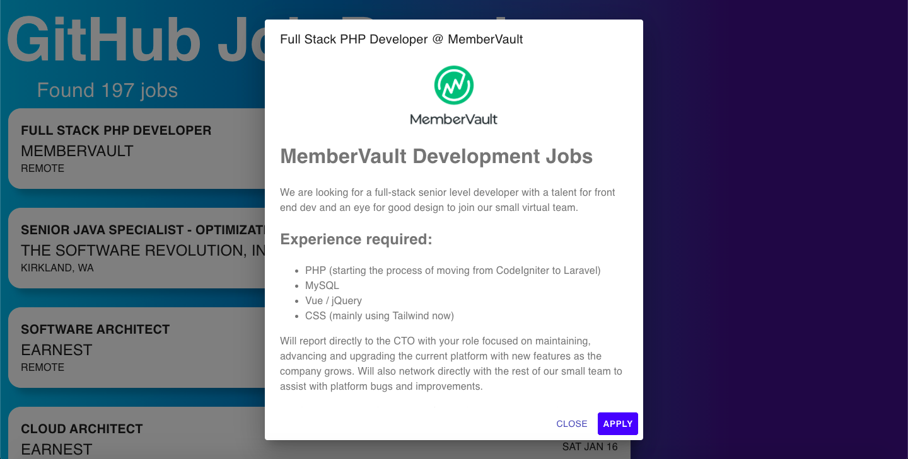

# GitHub Job Board

A web application which lists various jobs using the Github Jobs API. Built using React, Node.js, Express, Cron, TypeScript and Redis.

## Description

A simple web application which consists of a data feed, an API and a client end. The data feed is a cron job which fires every hour and gets updated jobs from Github Jobs and then populates it into a Redis datastore. The node.js API fetches jobs from redis and presents it to the frontend built with React, material-ui and TypeScript.

## Screenshot

 

## Dependencies

### For server

- `express`: For server
- `cron`: For running cron job
- `ioredis`: Redis client
- `node-fetch`: For making API calls
- `winston`: Logger
- `typescript`
- `prettier`

### For client

- `react`
- `material-ui`: For styling
- `axios`: For API calls
- `react-loader-spinner`: For loading animation
- `typescript`
- `prettier`

## To run

- Clone into repo

### For worker and server

- Cd into `server`
- Make sure your local Redis server is up and running
- Run `yarn` to install packages
- Run `yarn watch`
- Fire up a new terminal in same directory and run `yarn run dev-worker`
- Fire up a new terminal in same directory and set an env var `PORT` to `9000`
- Run `yarn run dev`
- Your worker and server should have started. If the hourly cron job is too slow, change cron tab in `src/worker/worker.ts`

### For client

- Cd into client and run `yarn`
- Run `yarn start`
